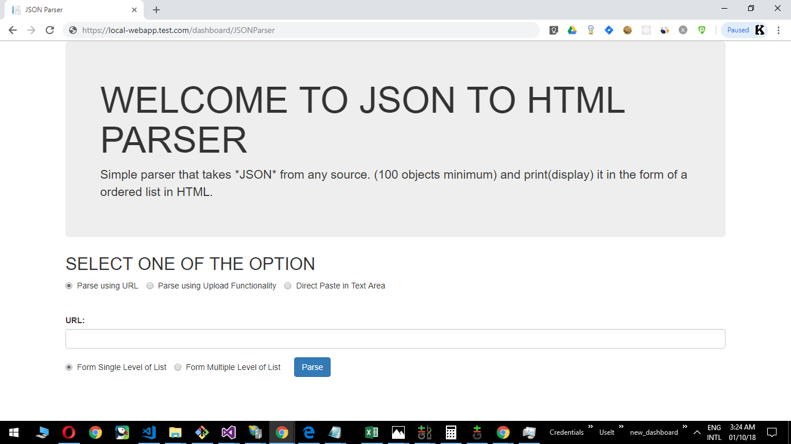
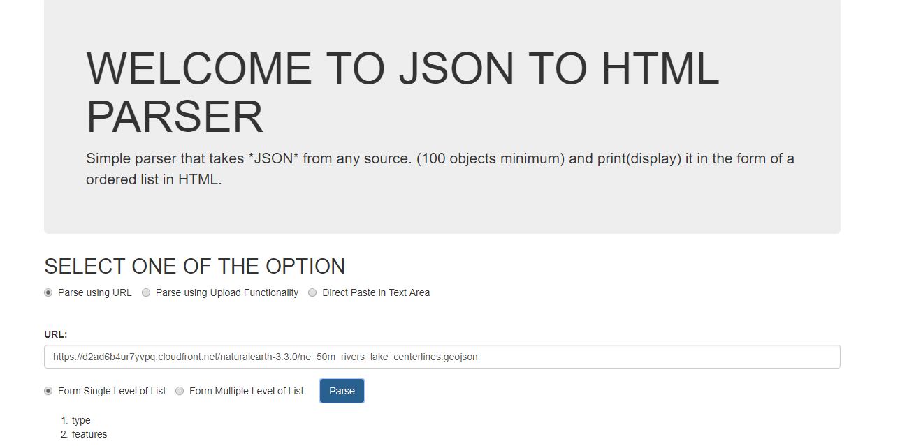
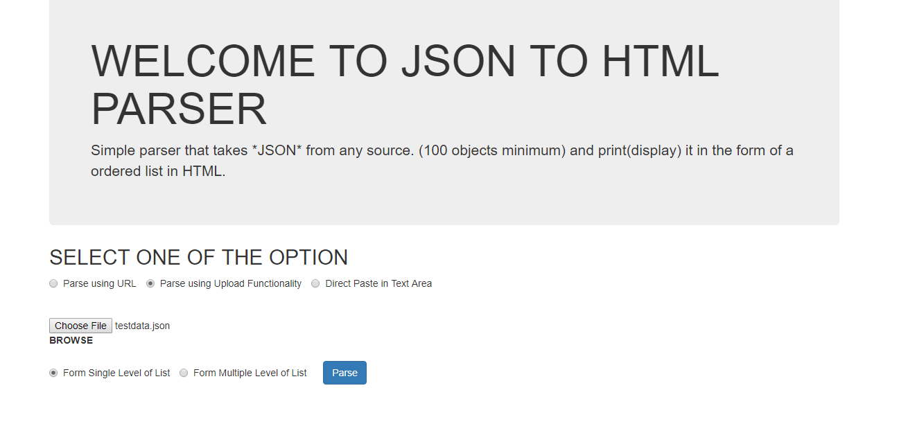
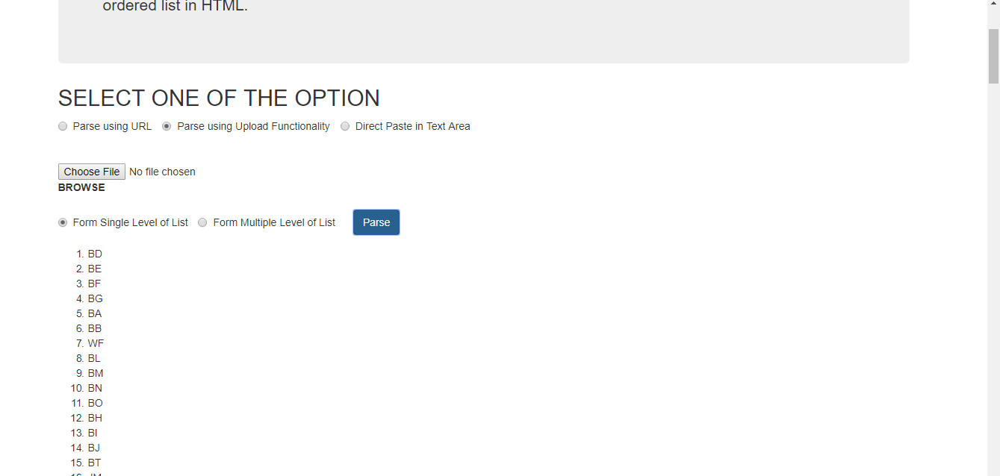
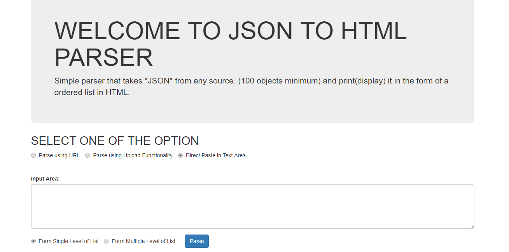
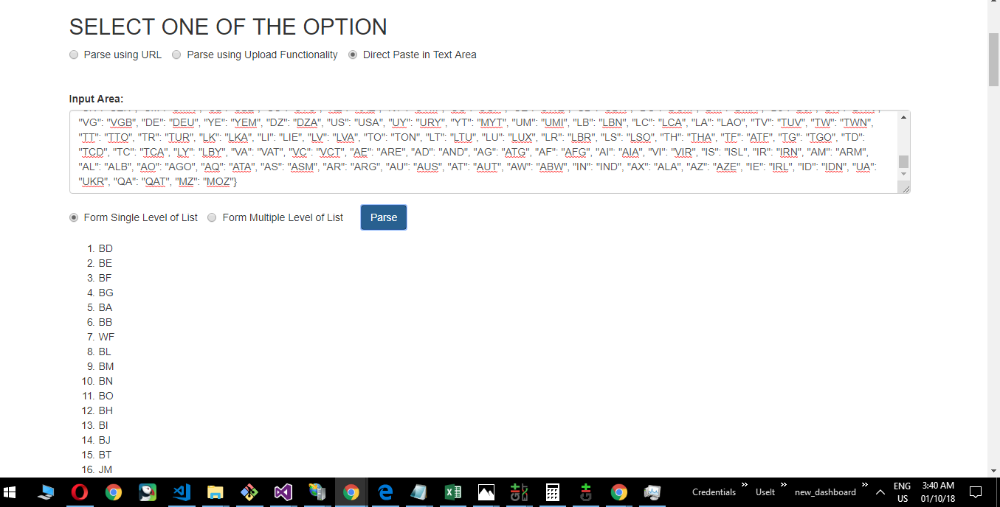
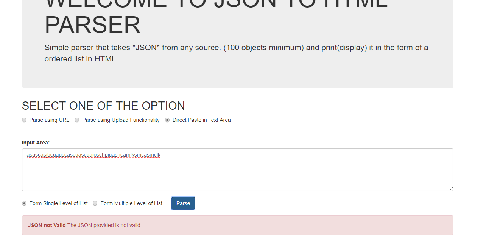

# JSON to HTML Parser

Write a simple parser takes *JSON* from any source. (100 objects minimum)
and print(display) it in the form of a ordered list in HTML.
Could be a single level. (No deeper nesting is required).
*Don’t use a library that handles the task for you. Write a vanilla JS*
*Removes Duplicates* (Should be done even if there are none)

## Getting Started

There are three ways in which once can upload the JSON data.
1. Using some hosted URL
2. Upload the file from system
3. Directly writing in the text area

### Configuring your Project

-- Notthing much. Just a HTML file, that can be run independently.

## Testing

To Test code:
1: Application Interface

2: Parsing the Data using URL

3: Parsing the Data by uploading the JSON

4: Parsing the Data directly

5: Giving wrong Input

## Future Enhancements required
- Multi level HTML parsing using Recussion